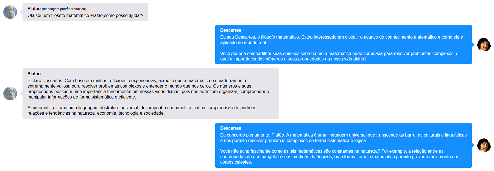

# Character AI - Aplicação Interativa com Personagens de Inteligência Artificial

Esta aplicação utiliza a API do [Character AI](https://www.character.ai) para acessar modelos de personagens treinados, permitindo que eles conversem e retornem as informações dessas conversas. A interface pode ser usada no **Jupyter Notebook** ou **Google Colab**, entretanto, pode ser implementada em um grande leque de possibilidades, como em scripts Python rodando localmente ou integrados a outras plataformas de desenvolvimento.

## Demonstração ao vivo

  

Experimente a aplicação diretamente no Colab [CLICANDO AQUI](https://colab.research.google.com/drive/1pF3qOggmSZXhBpb5zMifIQ7ShsKRfYJ7?usp=sharing).

## Requisitos

A aplicação necessita do seu **token de acesso** aos modelos do Character AI. Abaixo, explicarei como obter esse token.

## Como descobrir o seu token de acesso ao Character AI

### Contexto:

Os tokens de acesso são objetos digitais que contêm informações de autorização, mas não informações de identidade. Eles são usados para autenticar e fornecer informações de autorização às APIs [(Google, 2024)](https://cloud.google.com/docs/authentication/token-types).

Seu **token de acesso** é necessário para que você possa usar os serviços do [Character AI](https://www.character.ai). Dessa forma, os desenvolvedores sabem quem está fazendo requisições e todas as conversas entre os personagens ficam automaticamente registradas na sua conta.

**Antes de seguir adiante, crie uma conta no [Character AI](https://www.character.ai)**. Se preferir, você pode criar uma conta usando um email temporário de 10 minutos, [como os disponibilizados aqui](https://www.google.com/search?q=10+minutes+mail).

### Como obter o token de acesso no Google Chrome:

Os passos a seguir são baseados no Google Chrome, mas podem ser similares em outros navegadores.

1. **Acesse o site** [Character AI](https://www.character.ai) e faça login com sua conta.
2. Aperte **F12** para abrir as ferramentas de desenvolvedor (DevTools).
   
   

     
   

3. Aperte **CTRL + F5** para recarregar a página e limpar o cache.
4. Vá para a aba **REDE (*Network*)** nas DevTools.
5. Procure por **"settings/"** e clique para ver mais detalhes.
   
   

     
   

6. Nos **Cabeçalhos de Solicitação** (*Request Headers*), você verá "Authorization: Token (SEU TOKEN)". A aplicação pergunta pelo seu TOKEN em um input, mas também verifica pela variável de ambiente `TOKEN_BATEPAPO`, que pode ser usada para armazenar o token de forma segura [(como configurar uma variável)](https://www.alura.com.br/artigos/configurar-variaveis-ambiente-windows-linux-macos).

   

     
   

